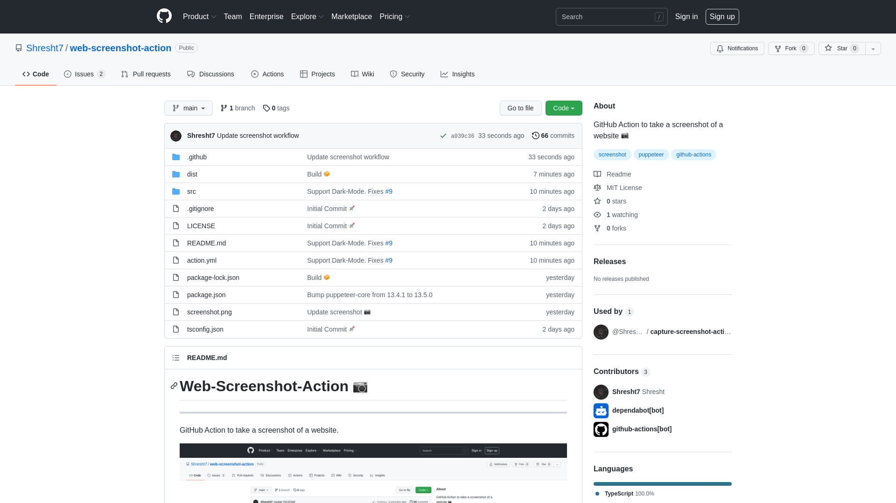

<!-- ===================== -->
<!-- WEB SCREENSHOT ACTION -->
<!-- ===================== -->

<h1 align='center'>
  📷 Web Screenshot Action 📷
</h1>

<!-- REPOSITORY BADGES -->
<!-- ================= -->

<div align='center'>

[](https://github.com/Shresht7/web-screenshot-action/releases)
[](./LICENSE)

</div>

<!-- DESCRIPTION -->
<!-- =========== -->

<p align='center'>
  <!-- slot: description -->
Capture screenshots of a website 📷
<!-- /slot -->
</p>

<!-- WORKFLOW BADGES -->
<!-- =============== -->

<div align='center'>

[](https://github.com/Shresht7/web-screenshot-action/actions/workflows/test.yml)
[](https://github.com/Shresht7/web-screenshot-action/actions/workflows/validate.yml)
[](https://github.com/Shresht7/web-screenshot-action/actions/workflows/action-readme.yml)
[](https://github.com/Shresht7/web-screenshot-action/actions/workflows/screenshot.yml)

</div>

<!-- TABLE OF CONTENTS -->
<!-- ================= -->

<details>

<summary align='center'>Table of Contents</summary>

- [📖 Usage](#-usage)
- [📋 Inputs](#-inputs)
- [📋 Outputs](#-outputs)
- [📄 Workflow Example](#-workflow-example)
- [📑 License](#-license)

</details>

---



<!-- USAGE -->
<!-- ===== -->

## 📖 Usage

Use this action in a workflow step and provide the URL you want to take the screenshot of.

```yaml
- name: Take Screenshot
  uses: Shresht7/web-screenshot-action@v1
  with:
    url: https://github.com/Shresht7/web-screenshot-action
```

The screenshot will be saved as `screenshot.png`. The file-path and type can be changed using [input parameters](#-inputs).

if `shouldCreateArtifacts` is set to `true`, an [artifact](https://help.github.com/en/actions/configuring-and-managing-workflows/persisting-workflow-data-using-artifacts) will be created with the generated screenshots.

Intended to be used as a sub-task in some other workflow, this action's only job is to generate the screenshots. What you do with them is up to you. See [example workflow](#-workflow-example).

---

## 📋 Inputs

<!-- slot: inputs -->
| Input                   | Description                                                            |          Default | Required |
| :---------------------- | :--------------------------------------------------------------------- | ---------------: | :------: |
| `url`                   | URL to take the screenshot of                                          |      `undefined` |     ✅    |
| `path`                  | Save screenshot as                                                     | `screenshot.png` |          |
| `width`                 | Viewport width                                                         |           `1920` |          |
| `height`                | Viewport height                                                        |           `1080` |          |
| `captureFullPage`       | Take screenshot of the entire page                                     |          `false` |          |
| `captureBeyondViewport` | Capture beyond the viewport constraints                                |          `false` |          |
| `omitBackground`        | Omit the background allowing for transparent images                    |          `false` |          |
| `encoding`              | Output screenshot encoding. (`base64` / `binary` / `undefined`)        |      `undefined` |          |
| `shouldCreateArtifacts` | Generate screenshot artifacts                                          |          `false` |          |
| `delay`                 | Wait for duration (in milliseconds) before taking a screenshot         |           `1000` |          |
| `darkMode`              | Enable dark mode by setting `prefers-color-scheme: dark` media feature |          `false` |          |
<!-- /slot -->

## 📋 Outputs

if `shouldCreateArtifacts` is set to `true`, an [artifact](https://help.github.com/en/actions/configuring-and-managing-workflows/persisting-workflow-data-using-artifacts) will be created with the screenshots.

<!-- slot: outputs -->

<!-- /slot -->

## 📄 Workflow Example

The [screenshot](#-web-screenshot-action) in this README is auto-generated using this action!

[`.github/workflows/screenshot.yml`](./.github/workflows/screenshot.yml):

[](https://github.com/Shresht7/web-screenshot-action/actions/workflows/screenshot.yml)


<!-- WORKFLOW EXAMPLE -->
<!-- ================ -->

<details>

<summary>
  click here to show the workflow
</summary>

<br />

<!-- slot: example,         prepend: ```yaml, append: ``` -->
```yaml
# ============================
#         SCREENSHOT
# ----------------------------
# Take screenshot of a website
# ============================

name: Screenshot

# Activation Events
# =================

on:
  workflow_dispatch: # When a workflow event is dispatched manually

# Jobs
# ====

jobs:
  screenshot:
    runs-on: ubuntu-latest

    name: Screenshot
    steps:
      # Actions/Checkout ✅
      # ===================

      # Required for GITHUB_WORKSPACE
      - name: Checkout
        uses: actions/checkout@v3

      # Take Screenshots 📷
      # ===================

      - name: Screenshot
        uses: Shresht7/web-screenshot-action@v1
        id: screenshot
        with:
          url: https://lb-embed-content.bokonon.dev/?username=laminthurein
          path: screenshot.png
          width: 900
          height: 1100

      - name: Screenshot-Light
        uses: Shresht7/web-screenshot-action@v1
        id: screenshot-light
        with:
          url: https://lb-embed-content.bokonon.dev/?username=laminthurein
          path: screenshots/screenshot-light.png

      - name: Screenshot-Dark
        uses: Shresht7/web-screenshot-action@v1
        id: screenshot-dark
        with:
          url: https://lb-embed-content.bokonon.dev/?username=laminthurein
          path: screenshots/screenshot-dark.png
          darkMode: true

      # Push to Main 🌐
      # ===============

      # Check if there are any changes in the current-working-directory
      - name: check for changes
        id: git-diff
        run: |
          if git diff --exit-code; then
          echo "changes_exist::false" 
          else
          echo "changes_exist::true" 
          fi

      - name: add, commit and push
        if: ${{ steps.git-diff.outputs.changes_exist == 'true' }}
        run: |
          git config user.name 'github-actions[bot]'
          git config user.email 'github-actions[bot]@users.noreply.github.com'
          git add .
          git commit -m 'Update screenshot 📷'
          git push

```
<!-- /slot -->

</details>

---

<!-- LICENSE -->
<!-- ======= -->

## 📑 License

> [MIT License](./LICENSE)