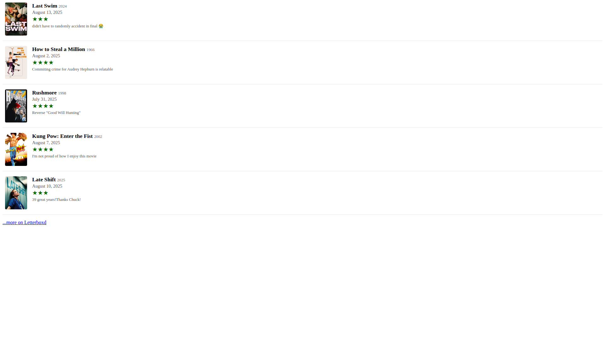

<!-- ===================== -->
<!-- WEB SCREENSHOT ACTION -->
<!-- ===================== -->

<h1 align='center'>
  📷 Web Screenshot Action 📷
</h1>

<!-- ================= -->
<!-- REPOSITORY BADGES -->
<!-- ================= -->

<div align='center'>

[](https://github.com/Shresht7/web-screenshot-action/releases)
[](./LICENSE)

</div>

<!-- =========== -->
<!-- DESCRIPTION -->
<!-- =========== -->

<p align='center'>
  <!-- slot: description  -->
GitHub Action to take screenshots of websites.
<!-- /slot -->
</p>

<!-- =============== -->
<!-- WORKFLOW BADGES -->
<!-- =============== -->

<div align='center'>

[](https://github.com/Shresht7/web-screenshot-action/actions/workflows/test.yml)
[](https://github.com/Shresht7/web-screenshot-action/actions/workflows/validate.yml)
[](https://github.com/Shresht7/web-screenshot-action/actions/workflows/action-readme.yml)

</div>

<!-- ================= -->
<!-- TABLE OF CONTENTS -->
<!-- ================= -->

<details>

<summary align='center'>Table of Contents</summary>

- [📖 Usage](#-usage)
  - [📋 Inputs](#-inputs)
  - [📋 Outputs](#-outputs)
- [📄 Workflow Setup](#-workflow-setup)
  - [Example](#example)
- [📑 License](#-license)

</details>

---



## 📖 Usage

```yaml
- name: Take Screenshot
  uses: Shresht7/web-screenshot-action@main
  with:
    url: https://github.com/Shresht7/web-screenshot-action
```

### 📋 Inputs

<!-- slot: inputs -->
| Input                   |                           Type | Description                                                                   |                  |
| ----------------------- | -----------------------------: | ----------------------------------------------------------------------------- | ---------------: |
| `url`                   |                       `string` | URL to take the screenshot of                                                 |     **required** |
| `path`                  |                       `string` | Screenshot filepath                                                           | `screenshot.png` |
| `width`                 |                       `number` | Viewport width                                                                |           `1920` |
| `height`                |                       `number` | Viewport height                                                               |           `1080` |
| `captureFullPage`       |                      `boolean` | Should take screenshot of the entire page                                     |          `false` |
| `captureBeyondViewport` |                      `boolean` | Should take screenshot beyond the viewport                                    |          `false` |
| `omitBackground`        |                      `boolean` | Should omit the background to take transparent screenshots                    |          `false` |
| `encoding`              | `'base64'/'binary'/undefined ` | Output encoding                                                               |      `undefined` |
| `shouldCreateArtifacts` |                      `boolean` | Should generate screenshot artifacts                                          |          `false` |
| `delay`                 |                       `number` | Should wait `x` milliseconds before taking screenshot                         |           `1000` |
| `darkMode`              |                      `boolean` | Should enable dark mode by setting `prefers-color-scheme: dark` media feature |          `false` |
<!-- /slot -->

### 📋 Outputs

if `shouldCreateArtifacts` is set to `true`, an [artifact](https://help.github.com/en/actions/configuring-and-managing-workflows/persisting-workflow-data-using-artifacts) will be created with the screenshots.

<!-- slot: outputs -->
<!-- /slot -->

## 📄 Workflow Setup

Intended to be used as a sub-task in some other workflow, this action's only job is to generate the screenshots. What you do with them is up to you.

### Example

The [screenshot](#-web-screenshot-action) in this README is auto-generated using this action!

[`.github/workflows/screenshot.yml`](./.github/workflows/screenshot.yml):

<!-- WORKFLOW EXAMPLE -->
<!-- ================ -->

<details>

<summary>
  click here to show the workflow
</summary>

<br />

<!-- slot: example, prepend: ```yaml, append: ``` -->
```yaml
# ============================
#         SCREENSHOT
# ----------------------------
# Take screenshot of a website
# ============================

name: Screenshot

# Activation Events
# =================

on:
  workflow_dispatch:  # When a workflow event is dispatched manually

# Jobs
# ====

jobs:
  screenshot:
    runs-on: ubuntu-latest
    
    name: Screenshot
    steps:
    
      # Actions/Checkout ✅
      # ===================

      # Required for GITHUB_WORKSPACE
      - name: Checkout
        uses: actions/checkout@v3

      # Take Screenshots 📷
      # ===================

      - name: Screenshot
        uses: Shresht7/web-screenshot-action@main
        id: screenshot
        with:
          url: https://www.github.com/Shresht7/web-screenshot-action
          path: screenshots/screenshot-light.png

      - name: Screenshot
        uses: Shresht7/web-screenshot-action@main
        id: screenshot
        with:
          url: https://www.github.com/Shresht7/web-screenshot-action
          path: screenshot.png

      - name: Screenshot-Dark
        uses: Shresht7/web-screenshot-action@main
        id: screenshot-dark
        with:
          url: https://www.github.com/Shresht7/web-screenshot-action
          path: screenshots/screenshot-dark.png
          darkMode: true

      # Push to Main 🌐
      # ===============

      - name: Commit
        run: |
          git config user.name 'github-actions[bot]'
          git config user.email 'github-actions[bot]@users.noreply.github.com'
          git add .
          git commit -m 'Update screenshot 📷'
          git push
```
<!-- /slot -->

</details>

<!-- LICENSE -->
<!-- ======= -->

## 📑 License

> [MIT License](./LICENSE)